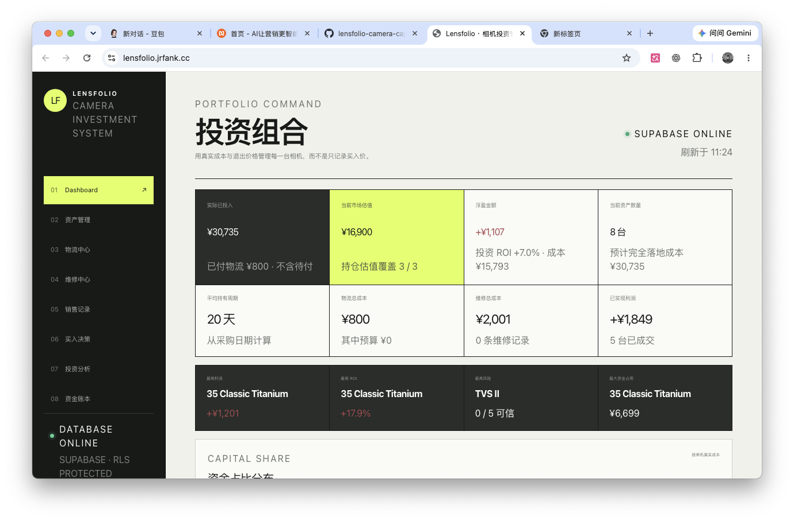
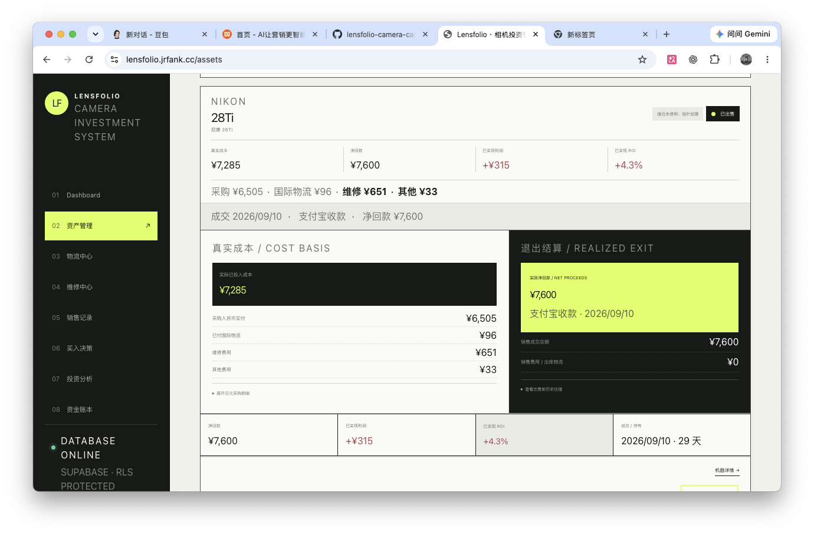
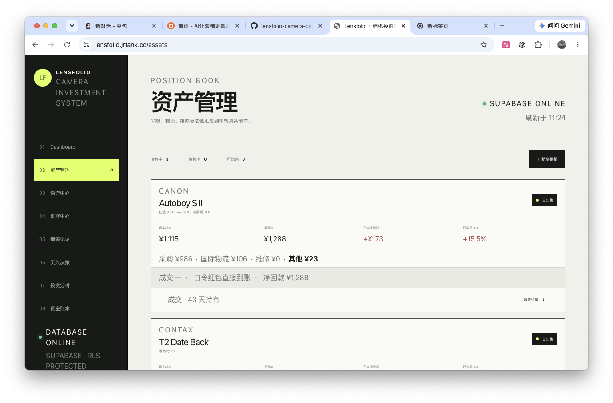

# Lensfolio Camera Capital

Open-source inventory, valuation and capital management system for camera collectors, resellers and photography businesses.

## Screenshots

### Dashboard

### Camera Detail

### Capital & Valuation

## Features

- Camera inventory management
- Purchase and sale records
- Profit and loss tracking
- Market valuation
- Repair and logistics records
- Capital ledger
- Supabase-backed data storage

## Tech Stack

- Next.js
- React
- TypeScript
- Supabase
- Drizzle ORM

## Getting Started

npm install
npm run dev

## Demo

[Live Demo](你的地址)

## License

MIT
